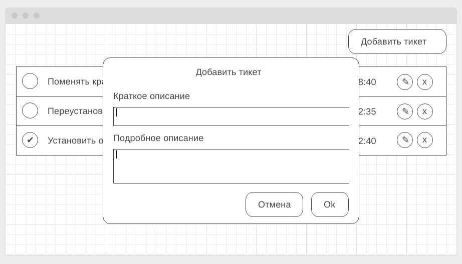

# Домашнее задание к занятию "7. Работа с HTTP" (frontend)

[](https://ci.appveyor.com/project/idontknow3210/ahj-http-frontend)

### Запуск сервера:

```md
1. npm i
2. npm start
```

Правила сдачи задания:

1. В рамках этого ДЗ можно использовать любой менеджер пакетов.
2. Frontend должен собираться через Webpack (включая картинки и стили) и выкладываться на Github Pages через Appveyor.
3. В README.md должен быть размещён бейджик сборки.

---

#### Легенда

API готово, пора приступить к своим прямым обязанностям - написанию фронтенда, который будет с этим API работать.

#### Описание

Общий вид списка тикетов (должны загружаться с сервера в формате JSON):


Модальное окно добавления нового тикета (вызывается по кнопке "Добавить тикет" в правом верхнем углу):



Модальное окно редактирования существующего тикета (вызвается по кнопке с иконкой "✎" - карандашик):


Модальное окно подтверждения удаления (вызывается по кнопке с иконкой "x" - крестик):


Для просмотра деталей тикета нужно нажать на тело тикета (но не на кнопки - "сделано", "редактировать" или "удалить"):


Ваше приложение должно реализовывать следующий функционал:
* Отображение всех тикетов
* Создание нового тикета
* Удаление тикета
* Изменение тикета
* Получение подробного описания тикета
* Отметка о выполнении каждого тикета

Весь этот функционал должен быть связан с сервером через методы. Например, для удаления нужно отправить запрос с соответствующим методом, получить подтверждение и подтянуть обновлённый список тасков.

В качестве бонуса можете отображать какую-нибудь иконку загрузки (см. https://loading.io) на время подгрузки.

Авто-тесты к данной задаче не требуются. Все данные и изменения должны браться/сохраняться на сервере.
